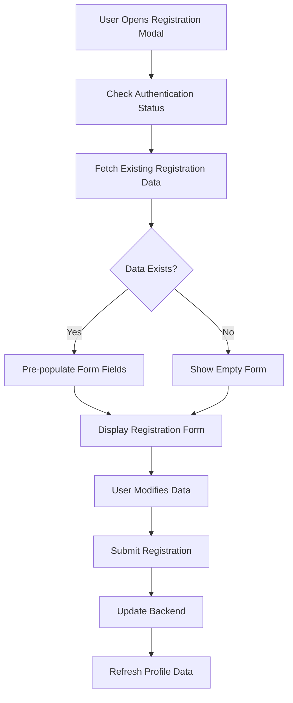
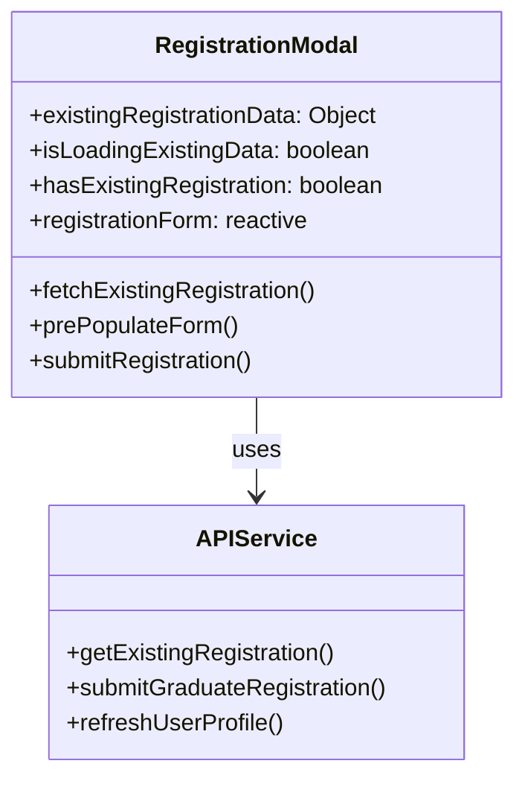
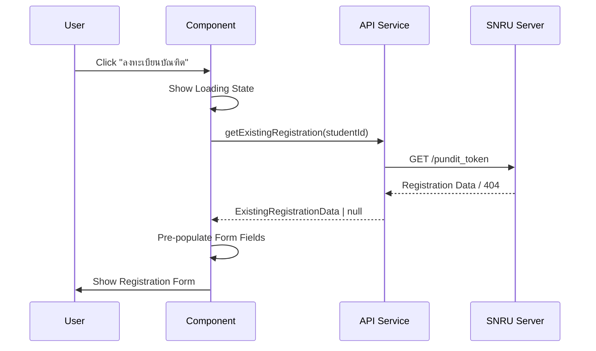

# Profile Page Registration Data Integration Design

## Overview

This design document outlines the implementation of fetching and displaying existing graduate registration data in the ProfilePage.vue component. The functionality will integrate with the SNRU API endpoint `https://admission.snru.ac.th/pundit_token` to retrieve previously submitted registration information and pre-populate the registration form.

## Technology Stack & Dependencies

- **Frontend Framework**: Vue 3 with Composition API
- **Mobile Framework**: Ionic Vue
- **HTTP Client**: Axios or Fetch API
- **State Management**: Vue Reactivity (ref/reactive)
- **Authentication**: Token-based authentication
- **API Endpoint**: `https://admission.snru.ac.th/pundit_token`

## Component Architecture

### Data Flow Architecture



### Component State Management



## API Integration Layer

### Registration Data Fetching

**Endpoint**: `GET https://admission.snru.ac.th/pundit_token`

**Request Headers**:
```javascript
{
  'Authorization': 'Bearer <user_token>',
  'Content-Type': 'application/json'
}
```

**Response Schema**:
```typescript
interface ExistingRegistrationData {
  student_id: string;
  full_name: string;
  faculty: string;
  program: string;
  attendance_status: number;
  gender?: string;
  dress_code_preference?: string;
  gown_size?: string;
  book_group_photo: boolean;
  photo_frame_type?: string;
  photo_quantity: number;
  phone_number?: string;
  email?: string;
  address?: string;
  moo?: string;
  tambol?: string;
  soi?: string;
  street?: string;
  amphur?: string;
  province?: string;
  zipcode?: string;
  notes?: string;
  registration_date?: string;
  last_updated?: string;
}
```

### API Service Methods

```typescript
// services/api.ts
export const getExistingRegistration = async (studentId: string): Promise<ExistingRegistrationData | null> => {
  const token = getAuthToken();
  const response = await fetch(`https://admission.snru.ac.th/pundit_token`, {
    method: 'GET',
    headers: {
      'Authorization': `Bearer ${token}`,
      'Content-Type': 'application/json'
    }
  });
  
  if (response.status === 404) {
    return null; // No existing registration
  }
  
  if (!response.ok) {
    throw new Error('Failed to fetch existing registration data');
  }
  
  return response.json();
};
```

## Form Pre-population Logic

### Data Loading Sequence



### Form Field Mapping

| API Field | Form Field | Data Type | Default Behavior |
|-----------|------------|-----------|------------------|
| `student_id` | `registrationForm.studentId` | string | Auto-filled from user profile |
| `full_name` | `registrationForm.fullName` | string | Auto-filled from user profile |
| `attendance_status` | `registrationForm.attendanceStatus` | string | Pre-select if exists |
| `gender` | `registrationForm.gender` | string | Pre-select if attendance_status = "1" |
| `gown_size` | `registrationForm.gownSize` | string | Pre-select if attendance_status = "1" |
| `phone_number` | `registrationForm.phoneNumber` | string | Pre-fill if exists |
| `address` | `registrationForm.address` | string | Pre-fill if exists |
| `book_group_photo` | `registrationForm.bookGroupPhoto` | boolean | Pre-check if true |

## Implementation Strategy

### 1. Enhanced Registration Modal Opening

```typescript
const openRegistrationModal = async () => {
  isRegistrationModalOpen.value = true;
  existingDataLoading.value = true;
  hasExistingRegistration.value = false;
  
  try {
    // Pre-fill basic user data
    if (user.value) {
      registrationForm.studentId = user.value.STUDENT_ID || "";
      registrationForm.fullName = user.value.FULLNAME2 || user.value.name || "";
      registrationForm.faculty = user.value.FAC_NAME_TH || "";
      registrationForm.program = user.value.PROGRAM_NAME_TH || "";
    }
    
    // Fetch existing registration data
    const existingData = await getExistingRegistration(user.value?.STUDENT_ID);
    
    if (existingData) {
      hasExistingRegistration.value = true;
      prePopulateFormWithExistingData(existingData);
    }
    
    // Load gown sizes
    await loadGownSizes();
    
  } catch (error) {
    console.error('Failed to load existing registration data:', error);
    // Show non-blocking error message
    showToast('ไม่สามารถโหลดข้อมูลการลงทะเบียนเดิมได้ กรุณาลองใหม่อีกครั้ง');
  } finally {
    existingDataLoading.value = false;
  }
};
```

### 2. Form Pre-population Function

```typescript
const prePopulateFormWithExistingData = (data: ExistingRegistrationData) => {
  registrationForm.attendanceStatus = data.attendance_status?.toString() || "";
  registrationForm.gender = data.gender || "";
  registrationForm.dressCodePreference = data.dress_code_preference || "";
  registrationForm.gownSize = data.gown_size || "";
  registrationForm.bookGroupPhoto = data.book_group_photo || false;
  registrationForm.photoFrameType = data.photo_frame_type || "";
  registrationForm.photoQuantity = data.photo_quantity || 1;
  registrationForm.phoneNumber = data.phone_number || "";
  registrationForm.email = data.email || "";
  registrationForm.address = data.address || "";
  registrationForm.moo = data.moo || "";
  registrationForm.tambol = data.tambol || "";
  registrationForm.soi = data.soi || "";
  registrationForm.street = data.street || "";
  registrationForm.amphur = data.amphur || "";
  registrationForm.province = data.province || "";
  registrationForm.zipcode = data.zipcode || "";
  registrationForm.notes = data.notes || "";
};
```

### 3. UI Enhancement for Existing Data

```vue
<!-- Loading State -->
<ion-card v-if="existingDataLoading" class="form-card">
  <ion-card-content class="ion-text-center">
    <ion-spinner name="crescent"></ion-spinner>
    <p>กำลังโหลดข้อมูลการลงทะเบียนเดิม...</p>
  </ion-card-content>
</ion-card>

<!-- Existing Data Indicator -->
<ion-card v-if="hasExistingRegistration && !existingDataLoading" class="form-card existing-data-card">
  <ion-card-header>
    <ion-card-title class="existing-data-title">
      <ion-icon :icon="informationCircle" class="section-icon"></ion-icon>
      ข้อมูลการลงทะเบียนเดิม
    </ion-card-title>
  </ion-card-header>
  <ion-card-content>
    <div class="existing-data-notice">
      <ion-icon :icon="checkmarkCircle" color="success"></ion-icon>
      <p>พบข้อมูลการลงทะเบียนเดิม ข้อมูลดังกล่าวได้ถูกใส่ในฟอร์มแล้ว คุณสามารถแก้ไขข้อมูลได้</p>
    </div>
  </ion-card-content>
</ion-card>
```

## Error Handling Strategy

### Error Types and Responses

| Error Type | HTTP Status | User Message | Action |
|------------|-------------|--------------|---------|
| Network Error | - | "ไม่สามารถเชื่อมต่อเซิร์ฟเวอร์ได้" | Allow form usage with empty data |
| Unauthorized | 401 | "กรุณาเข้าสู่ระบบใหม่" | Redirect to login |
| Not Found | 404 | Show empty form | Continue with empty form |
| Server Error | 500 | "เกิดข้อผิดพลาดจากเซิร์ฟเวอร์" | Allow form usage with empty data |

### Error Handling Implementation

```typescript
const handleFetchError = (error: any) => {
  if (error.code === 'NETWORK_ERROR') {
    showToast('ไม่สามารถเชื่อมต่อเซิร์ฟเวอร์ได้ กรุณาตรวจสอบการเชื่อมต่ออินเทอร์เน็ต');
  } else if (error.response?.status === 401) {
    showToast('กรุณาเข้าสู่ระบบใหม่');
    clearAuth();
    router.push('/login');
  } else if (error.response?.status === 404) {
    // No existing registration - this is normal
    console.log('No existing registration found');
  } else {
    showToast('ไม่สามารถโหลดข้อมูลการลงทะเบียนเดิมได้');
  }
};
```

## State Management Enhancement

### Additional Reactive Variables

```typescript
// Add to existing reactive variables
const existingDataLoading = ref(false);
const hasExistingRegistration = ref(false);
const existingRegistrationData = ref<ExistingRegistrationData | null>(null);
const lastUpdated = ref<string>('');
```

### Form Validation Updates

```typescript
const validateForm = () => {
  const errors = [];
  
  if (!registrationForm.attendanceStatus) {
    errors.push('กรุณาเลือกสถานะการลงทะเบียน');
  }
  
  if (registrationForm.attendanceStatus === '1') {
    if (!registrationForm.gender) {
      errors.push('กรุณาเลือกเพศ');
    }
    if (!registrationForm.gownSize) {
      errors.push('กรุณาเลือกขนาดชุดครุย');
    }
  }
  
  if (!registrationForm.phoneNumber) {
    errors.push('กรุณากรอกเบอร์โทรศัพท์');
  }
  
  return errors;
};
```

## Testing Strategy

### Unit Testing Scenarios

1. **Data Fetching Tests**
   - Test successful data retrieval
   - Test 404 response handling
   - Test network error handling
   - Test authentication error handling

2. **Form Pre-population Tests**
   - Test form field mapping accuracy
   - Test conditional field population
   - Test data type conversions

3. **Integration Tests**
   - Test complete registration flow with existing data
   - Test form submission with pre-populated data
   - Test data refresh after successful submission

### Test Implementation Example

```typescript
describe('Registration Data Fetching', () => {
  it('should pre-populate form when existing data is found', async () => {
    const mockData = {
      attendance_status: 1,
      gender: 'M',
      phone_number: '0812345678'
    };
    
    vi.mocked(getExistingRegistration).mockResolvedValue(mockData);
    
    await openRegistrationModal();
    
    expect(registrationForm.attendanceStatus).toBe('1');
    expect(registrationForm.gender).toBe('M');
    expect(registrationForm.phoneNumber).toBe('0812345678');
  });
});
```